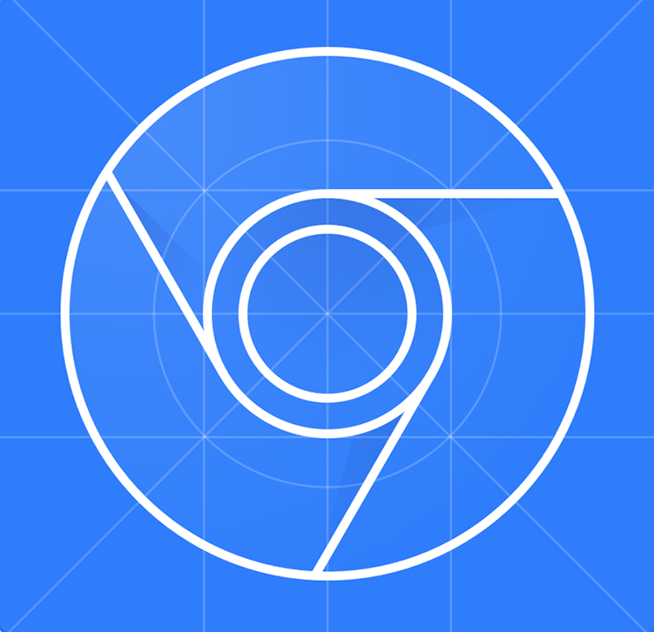

<h1 align="center">Hi 👋, I'm Evgeniy</h1>
<h3 align="center">I'm a QA Engineer with glowing eyes. Looking for remote job! </h3>

  

<h3 align="left"> &#128064 About me:</h3>
<h5 align="left">
I am a manual tester learning test automation in Python. I constantly study new technologies, methods and tools 
related to testing in order to keep abreast of the latest trends and apply them in practical work. I actively 
participate in online courses, reading professional books and forums where I can learn from experienced professionals. 
I also look forward to participating in professional conferences and meetups to share knowledge and connect with 
colleagues from the testing industry. All this helps me not only develop as a test automator, but also bring great 
value to the team and achieve high results.
</h5>

<h2 align="center"><a href="https://github.com/evgenfromgus/Portfolio">	&#127891 All my cases, you can see here ! 	&#127891;</a></h2>

  

  

<h3 align="left"> 	&#128241 Connect with me:</h3>

<h3 align="left"> &#128736 Languages and Tools:</h3>

 
 
 
 
 
 
 
 
 
 
 
 
 
 
 

 
   
 
 
 
 
 
 
 
 
 

&nbsp;

